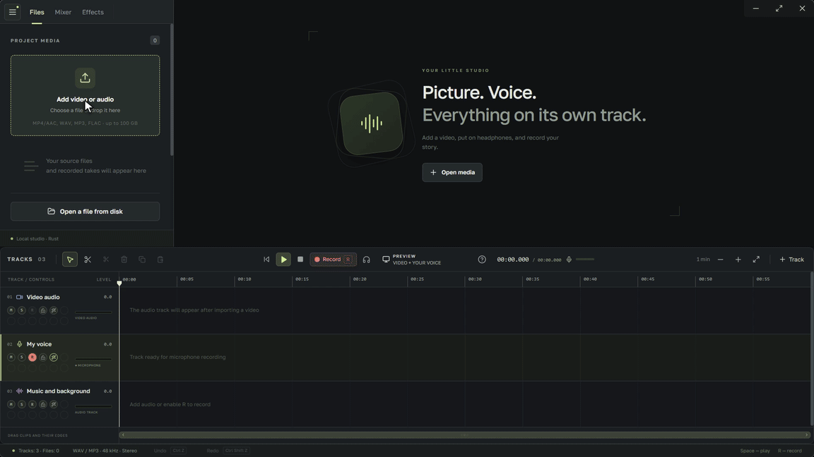
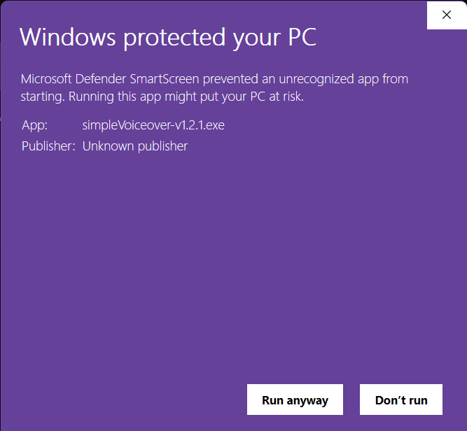
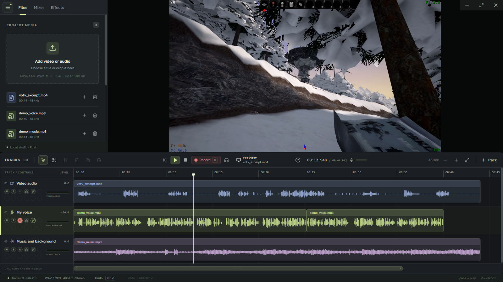
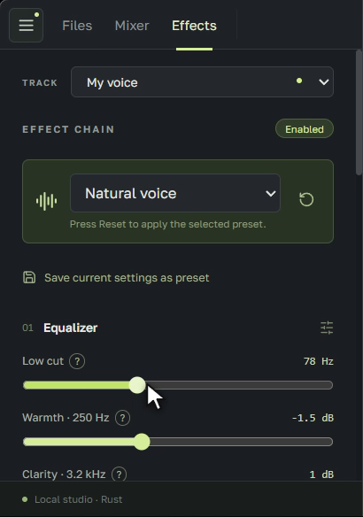
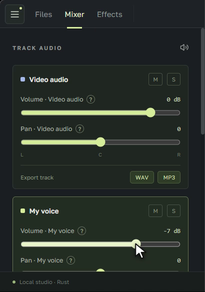
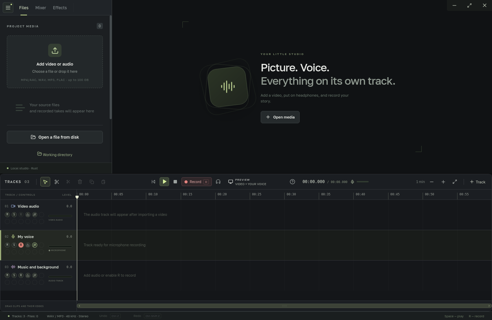
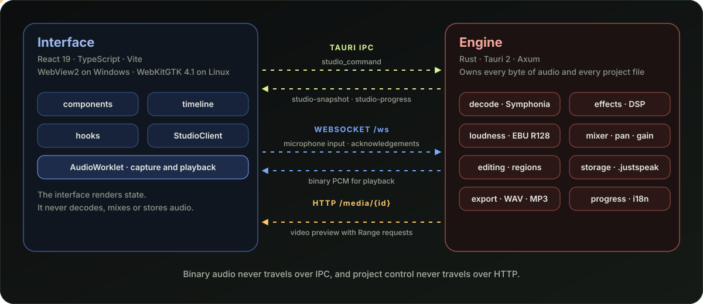

<div align="center">



<br>

[](https://github.com/arconw/simpleVoiceover/releases)
[](#download)
[](#under-the-hood)
[](#features)
[](LICENSE)

**[Download](#download)** · **[Features](#features)** · **[Under the hood](#under-the-hood)** · **[Build](#build-from-source)** · **[Manual](docs/MANUAL.md)** · **[YouTube](https://www.youtube.com/@arco9-lab)**

<br>



<sub>Real app, real recording: import, cut, shape the voice, balance the mix.</sub>

<br>
<br>

<a href="https://www.youtube.com/@arco9-lab"></a>&nbsp;
<a href="https://www.youtube.com/@arco9-lab"><b>Arco9 Lab on YouTube</b></a>

</div>

<br>

simpleVoiceover is a small desktop studio for recording a voice over a video. Drop in a clip, put on headphones, press <kbd>R</kbd>, and talk. Picture, voice and music each live on their own track, so you can cut, move, mute and polish them without touching the originals.

It is a single native application. There is no FFmpeg to install, no console window, and no background media service to babysit: the Rust engine decodes, processes, mixes and exports everything itself.

## Download

Download **[version 1.3.0](https://github.com/arconw/simpleVoiceover/releases/tag/v1.3.0)** for Windows or Linux. All four packages are for x86_64.

<div align="center">

[](https://github.com/arconw/simpleVoiceover/releases/download/v1.3.0/simpleVoiceover-v1.3.0.exe)
&nbsp;
[](https://github.com/arconw/simpleVoiceover/releases/download/v1.3.0/simpleVoiceover_1.3.0_amd64.AppImage)

</div>

| Platform            | Package                                                                                                             |           Size | Requirements and recommendations                                                                                                            |
| ------------------- | ------------------------------------------------------------------------------------------------------------------- | -------------: | ------------------------------------------------------------------------------------------------------------------------------------------- |
| **Windows**         | [EXE](https://github.com/arconw/simpleVoiceover/releases/download/v1.3.0/simpleVoiceover-v1.3.0.exe)                |  15.3&nbsp;MiB | Needs the WebView2 Runtime. Single executable.                                                                                              |
| **Linux AppImage**  | [AppImage](https://github.com/arconw/simpleVoiceover/releases/download/v1.3.0/simpleVoiceover_1.3.0_amd64.AppImage) | 134.2&nbsp;MiB | **glibc 2.35+**, a graphical desktop and PulseAudio or PipeWire with its PulseAudio service. WebKitGTK and the media framework are bundled. |
| **Debian / Ubuntu** | [DEB](https://github.com/arconw/simpleVoiceover/releases/download/v1.3.0/simpleVoiceover_1.3.0_amd64.deb)           |   6.0&nbsp;MiB | **Ubuntu 26.04 LTS recommended.** Requires glibc 2.35+ and system WebKitGTK 4.1 (2.40+); `apt` installs the other dependencies.             |
| **Fedora**          | [RPM](https://github.com/arconw/simpleVoiceover/releases/download/v1.3.0/simpleVoiceover-1.3.0-1.x86_64.rpm)        |   6.0&nbsp;MiB | **Fedora 44 recommended.** Uses system WebKitGTK 4.1 and Fedora audio/video packages; `dnf` installs the dependencies.                      |

Recommended distributions are not hard installation restrictions. Older Debian/Ubuntu and Fedora releases may work when their libraries satisfy the package dependencies, but using them is at your own risk. The exact configurations exercised by the Linux test bench are listed in [verification](linux-testbench/VERIFICATION.md). Ubuntu 26.04 is the recommended current LTS, rather than a configuration claimed as tested by that bench. [Fedora 45 is currently Beta](https://discussion.fedoraproject.org/t/fedora-linux-45-beta-released/202136) and has not been verified.

The 1.3.0 Linux artifacts were rebuilt on **Ubuntu 22.04 / glibc 2.35**, removing the previous release's glibc 2.43 requirement. AppImage provides the most portable Linux package, but its glibc baseline still applies; it does not run on every Linux distribution. Check downloads against [SHA-256 checksums](https://github.com/arconw/simpleVoiceover/releases/download/v1.3.0/checksums.sha256).

> **Windows:** the executable is not code-signed yet, so SmartScreen shows "Windows protected your PC" on first launch. See the Windows details below for how to run it.

Linux install:

```bash
sudo apt install ./simpleVoiceover_1.3.0_amd64.deb
simpleVoiceover
```

Fedora install:

```bash
sudo dnf install ./simpleVoiceover-1.3.0-1.x86_64.rpm
simpleVoiceover
```

AppImage:

```bash
chmod +x simpleVoiceover_1.3.0_amd64.AppImage
./simpleVoiceover_1.3.0_amd64.AppImage
```

If FUSE is unavailable, run the AppImage with `--appimage-extract-and-run`. All Linux formats need a working graphical session and an active PulseAudio-compatible audio server.

<details>
<summary><b>Linux: WebKitGTK requirements and common problems</b></summary>

<br>

simpleVoiceover draws its interface with **WebKitGTK 4.1**, the web engine Tauri 2 uses on Linux. DEB uses `libwebkit2gtk-4.1-0`; RPM uses `webkit2gtk4.1`. Native packages also depend on GTK 3, the XDG desktop portals and GStreamer audio/video plugins, which the package manager installs together. AppImage bundles WebKitGTK and the media framework.

**1. Check what is installed**

```bash
dpkg -s libwebkit2gtk-4.1-0 | grep -E '^(Status|Version)'
```

No output, or a status other than `install ok installed`, means WebKitGTK is missing.

**2. Install or update it**

```bash
sudo apt update
sudo apt install libwebkit2gtk-4.1-0
```

The second command installs the library if it is missing and upgrades it to the newest version your distribution ships. Restart the app afterwards. Take WebKitGTK from your distribution only: it is a browser engine and receives frequent security fixes through normal updates.

**3. `Unable to locate package` or unmet dependencies**

Check the requirements of the exact release and package you downloaded. Version 1.3.0 uses a glibc 2.35 baseline, so Ubuntu 24.04's glibc 2.39 satisfies it. Ubuntu 20.04 and Debian 11 do not satisfy the release baseline and lack the required WebKitGTK 4.1 packages for native installation. Use a supported distribution or a compatible package; changing dependency declarations cannot remove newer library symbols from an executable. Upgrade glibc through your distribution's normal system upgrades.

**Common problems**

- **Blank window, or a crash at start** (often NVIDIA drivers or Wayland): run `WEBKIT_DISABLE_DMABUF_RENDERER=1 simpleVoiceover`. If that is not enough, add `WEBKIT_DISABLE_COMPOSITING_MODE=1`. These are standard WebKitGTK switches, not simpleVoiceover settings.
- **The video preview stays black:** visual playback depends on the codecs your system provides. Try `sudo apt install gstreamer1.0-plugins-bad gstreamer1.0-plugins-ugly` and restart the app.
- **File dialogs do not open:** they use the XDG desktop portal. `xdg-desktop-portal-gtk` comes with the package; on KDE also install `xdg-desktop-portal-kde`, then run `systemctl --user restart xdg-desktop-portal`.
- **WSL:** you need WSLg for a visible window and its PulseAudio bridge for sound.

</details>

<details>
<summary><b>Windows: "Windows protected your PC" (SmartScreen)</b></summary>

<br>



The executable is not code-signed yet, so Microsoft Defender SmartScreen reports an **Unknown publisher** the first time you run it. Windows shows this for any new unsigned app, and for unsigned files the reputation starts from zero with every new version. It does not mean that a threat was found.

**To run it**, click **More info**, then **Run anyway**. Or unblock the file before the first launch: right-click it, choose **Properties**, tick **Unblock**, and press **OK**. In PowerShell:

```powershell
Unblock-File .\simpleVoiceover-v1.3.0.exe
```

**To verify the download**, compare its checksum with [checksums.sha256](https://github.com/arconw/simpleVoiceover/releases/download/v1.3.0/checksums.sha256):

```powershell
Get-FileHash .\simpleVoiceover-v1.3.0.exe -Algorithm SHA256
```

Download the file only from this repository's Releases page. On Windows 11 with **Smart App Control** turned on, unsigned apps can be blocked outright, and then the app cannot be started until the executable is signed.

</details>

All versions are listed on the [Releases](https://github.com/arconw/simpleVoiceover/releases) page.

## Features

<table>
<tr>
<td width="50%" valign="top">

**🎞️ Multitrack timeline**<br>
Video audio, your voice and music sit on separate tracks. Split with 48 kHz sample accuracy, drag clips between tracks, select intervals across several tracks, copy and paste sections, and undo anything.

The primary video scope is H.264 MP4 and Matroska (MKV). Importing Matroska creates an independent track for each audio stream above the voice track; multistream MP4 uses the same layout. Starting delays and language metadata are retained. The first stream plays initially, and additional streams start muted. Each can be processed and exported separately.

</td>
<td width="50%" valign="top">

**🎙️ Record over the picture**<br>
Arm one track, press <kbd>R</kbd>, and record at the playhead while the other tracks play. Takes are stored raw; effects are applied during playback and export, so you can change your mind later.

</td>
</tr>
<tr>
<td valign="top">

**🎛️ Voice effects chain**<br>
High-pass, equalizer, presence, low-pass, an RMS compressor and a soft expander, with presets such as Natural voice, Podcast and Noisy room. Selecting a preset applies it immediately. Changing its settings shows **Custom Preset**; save it under your own name to reuse it. Every slider has a `?` that explains it with a small schematic.

</td>
<td valign="top">

**📏 Loudness normalization**<br>
EBU R128 measurement with oversampled true peaks aims at −16 LUFS and a −1.5 dBTP ceiling by default. Both targets are adjustable, and the measurement is cached, so editing a fader never re-analyzes the audio.

</td>
</tr>
<tr>
<td valign="top">

**🎚️ Mixer and export**<br>
Volume, pan, mute and solo per track. When any tracks have Solo enabled, only those tracks play. Other tracks are dimmed in the mixer and timeline, with a tooltip naming the Solo tracks. Export a single track or the whole mix as WAV (16-bit stereo, 48 kHz, RF64 for huge files) or MP3 (256 kbps). Suggested filenames use the track name for individual exports and the project name for the mix.

The magnet button beside the scissors toggles snapping when moving or trimming clips. Selected groups keep their relative positions while snapping to clip edges on their destination tracks. Delete a track with the trash button at the bottom right of its controls or mixer strip, then confirm. Undo restores the track and its clips. Locked tracks must be unlocked before deletion.

</td>
<td valign="top">

**📦 One portable project file**<br>
A `.justspeak` project holds sources, takes, waveforms and edits in a single indexed file. Saves are incremental and crash-safe, so a volume tweak does not rewrite your media.

</td>
</tr>
<tr>
<td valign="top">

**🌍 13 interface languages**<br>
English, Russian, French, Polish, Spanish, Portuguese, German, Italian, Ukrainian, Turkish, Japanese, Korean and Simplified Chinese. Switching applies immediately.

</td>
<td valign="top">

**🧱 Built for big files**<br>
Source files up to 100 GB are streamed from disk with 64-bit offsets. Import copies and decodes in a single pass, and AAC-LC, MP3, WAV, FLAC, ALAC and Vorbis are supported.

</td>
</tr>
</table>

## A look around

Choose the input and output devices in **Settings**. **System Default** follows changes in the system sound settings while the app is running. On Linux, PulseAudio and PipeWire devices are checked once per second, and only this app's streams are moved. Device choices persist between launches. A disconnected device temporarily falls back to the system default and is selected again when it returns. Stop recording before changing the input selection; output selection remains available during recording.

On Linux, the muted video preview discards its decoded audio without opening an audio device. The project mix has its own system mixer identity and carries all audible sound. Video follows the mix position without repeatedly restarting seeks while buffering. Rapid seeking keeps the latest requested position and discards position updates and audio from earlier playback. Double-click the preview to expand it using native window fullscreen; press Escape or double-click again to return to the studio. Dragging the preview moves the window outside fullscreen.

<div align="center">



<br>
<br>

<table>
<tr>
<td align="center"></td>
<td align="center"></td>
</tr>
<tr>
<td align="center"><sub><b>Effects</b> — presets, equalizer, compressor</sub></td>
<td align="center"><sub><b>Mixer</b> — volume, pan, solo, per-track export</sub></td>
</tr>
</table>

<br>



<sub>The same interface runs natively on Linux through WebKitGTK.</sub>

</div>

## Under the hood

The interface is deliberately thin. React renders state and forwards intent; the Rust engine owns every byte of audio and every project file. The two sides talk over three narrow channels, and each one carries only what it is meant to.

<div align="center">



</div>

- **Tauri IPC** carries commands from the interface and events (snapshots, progress) back to it. It never carries audio.
- **A binary WebSocket** carries PCM for playback, microphone input and delivery acknowledgements. An `AudioWorklet` does the physical capture and output.
- **HTTP** streams the original video to the preview with Range requests. It exposes no project control.
- **Decoding** uses [Symphonia](https://github.com/pdeljanov/Symphonia). Blocks of PCM are written as they are decoded, buffers are reused, and 48 kHz input skips resampling entirely.
- **Import** copies and decodes at once. Repeated reads and backward seeks reuse the regions already copied, and jumping to an MP4 index at the end of a file does not copy everything before it first.

### Signal chain

The default **Natural voice** preset, in processing order:

| Stage          | Setting                                                          |
| -------------- | ---------------------------------------------------------------- |
| High-pass      | 70 Hz                                                            |
| Equalizer      | 250 Hz, −1.5 dB                                                  |
| Presence       | 3.2 kHz, +1 dB                                                   |
| Low-pass       | 15 kHz                                                           |
| RMS compressor | −24 dB threshold, 2.3:1, 12 ms attack, 160 ms release, soft knee |
| Soft expander  | quiet-section attenuation, off by default                        |
| Makeup gain    | +2.9 dB                                                          |
| Loudness       | −16 LUFS, −1.5 dBTP true-peak ceiling                            |
| Volume and pan | per track, applied after normalization                           |

Normalization is a single constant gain computed from a bounded-memory histogram measurement, capped at +30 dB. If peak headroom prevents reaching the target, the gain stays lower: the app never reshapes dynamics to force a number. No media is rewritten.

### Project storage

<div align="center">



</div>

- A project is **one file, uncompressed**, with a 64-bit offset index. Playback, HTTP Range and export read straight from it without extraction.
- **Ctrl+S appends** only new media, edits and a fresh index, and reuses existing regions. Saving an edit copies no audio or video.
- **Two alternating header slots**, each guarded by CRC32, commit a save. Data and index are synced before a slot is updated, so an interrupted append is ignored and the previous revision stays readable.
- **Save as** compacts the file to the current data and atomically replaces the destination.
- Version 1.2 still opens older ZIP64 projects and migrates them on the next save.

### Tech stack

| Layer     | Technology                                                                   |
| --------- | ---------------------------------------------------------------------------- |
| Interface | React 19, TypeScript, Vite, Golos Text                                       |
| Desktop   | Tauri 2 with WebView2 on Windows and WebKitGTK 4.1 on Linux                  |
| Engine    | Rust, Tokio, Axum, Symphonia, ebur128, shine-rs (MP3), zip (legacy projects) |
| Tests     | Vitest for the interface, `cargo test` for the engine and storage            |

The test suite covers sample-accurate splitting, recording and Undo/Redo, append-only saves, interrupted saves, compaction, ZIP64 migration, seeks beyond 4 GiB, WAV and MP3 round trips, HTTP Range, origin restrictions, WebSocket and localization parity. A full 100 GB project has not been stress-tested.

## Keyboard

<details>
<summary>Shortcuts</summary>

<br>

| Keys                  | Action                           |
| --------------------- | -------------------------------- |
| Space                 | Play / pause                     |
| R                     | Start / finish recording         |
| V / X                 | Select / split tool              |
| Delete                | Remove selected clip             |
| Home                  | Go to start                      |
| Ctrl+S / Ctrl+Shift+S | Save / save as                   |
| Ctrl+Z / Ctrl+Shift+Z | Undo / redo                      |
| Ctrl+C / Ctrl+V       | Copy section / paste at playhead |
| Ctrl+ + / Ctrl+ −     | Horizontal timeline zoom         |
| Ctrl+wheel            | Zoom at the pointer              |

</details>

## Build from source

You need Node.js and a Rust toolchain.

```bash
npm ci
npm test
npm run build
```

Build a Debian package on Ubuntu:

```bash
sudo apt install build-essential pkg-config libwebkit2gtk-4.1-dev librsvg2-dev libpulse-dev libgstreamer1.0-dev
bin/build-deb
```

Build all three Linux formats with `bin/build-linux`, or choose one with `bin/build-deb`, `bin/build-rpm`, or `bin/build-appimage`. Each script copies its versioned artifacts to `build/` and replaces a repeated build of the same version. Windows builds use `bin/build-windows` and also write to `build/`. Cargo keeps intermediate files in `build/.cache/`. The entire `build/` directory is excluded from Git; obsolete builds and backup copies are removed.

Linux release builds use **Ubuntu 22.04 / glibc 2.35** as their build baseline. Building on a newer system can raise the minimum library versions, as described in [Tauri's Linux packaging guide](https://v2.tauri.app/distribute/debian/#limitations). AppImage bundles WebKitGTK and the media framework. DEB and RPM install distribution-specific dependencies. DEB accepts both `libgtk-3-0` and `libgtk-3-0t64` and requires WebKitGTK 4.1 version 2.40 or newer. **Ubuntu 26.04 LTS is recommended for DEB and Fedora 44 for RPM**, while dependency declarations retain the older library baseline. These recommendations, build requirements, and verified runtime configurations are separate; actual observations and codec limits are recorded in [the Linux test bench verification](linux-testbench/VERIFICATION.md).

Fedora H.264 preview support depends on installed codecs. The RPM requires `gstreamer1-plugin-openh264`, available from Fedora's `fedora-cisco-openh264` repository; see [Fedora's OpenH264 guide](https://fedoraproject.org/wiki/OpenH264). Playback and recording need an active PulseAudio-compatible server, provided by PipeWire or PulseAudio.

Keep the application version synchronized across npm, Cargo, their lockfiles, and Tauri. When a release commit is authorized, create its annotated `v<version>` tag and attach the four build formats to that GitHub Release when publication is authorized. Record the build distribution, required library versions, verified runtime distributions, and checksums separately for each artifact. The published v1.2.1 DEB retains its original requirements.

Cross-build the Windows executable from WSL (needs the `x86_64-pc-windows-msvc` target, `cargo-xwin` and LLVM's `llvm-rc`):

```bash
bin/build-windows
```

The [Windows build](.github/workflows/windows-build.yml) workflow builds the same executable from source on GitHub-hosted runners. Start it from the Actions tab and download the `simpleVoiceover-windows-x64` artifact.

## Linux compatibility test bench

The standalone [Linux test bench](linux-testbench/README.md) is included in the repository and can be deployed after cloning. It supports automatic checks and manual desktops with two virtual microphones and two outputs, optional routing through the host's default devices, distribution/audio/WebKit/codec presets, and QEMU guests for different kernels. Media fixtures are generated procedurally; no user media is included.

Install its documented host tools, place the release artifacts in `build/`, and start with:

```bash
linux-testbench/lab doctor
linux-testbench/lab prepare ubuntu22-pulse
linux-testbench/lab fixtures
linux-testbench/lab auto ubuntu22-pulse --extended
linux-testbench/lab manual ubuntu22-pulse
```

Generated media, container workspaces, VM disks, caches and test reports are excluded from Git. The [verification record](linux-testbench/VERIFICATION.md) documents the configurations exercised for 1.3.0; Windows runtime checks are performed manually.

The full guide to editing, effects, storage and the build is in the **[manual](docs/MANUAL.md)**.

## Arco9 Lab

<div align="center">

<a href="https://www.youtube.com/@arco9-lab"></a>

**[Arco9 Lab on YouTube](https://www.youtube.com/@arco9-lab)**

</div>

## License

simpleVoiceover is released under the [MIT License](LICENSE). Third-party libraries keep their own licenses: Symphonia (MPL-2.0), shine-rs (LGPL-2.0), zip (MIT) and ebur128 (MIT). Exact versions are locked in `backend/Cargo.lock` and `package-lock.json`.
